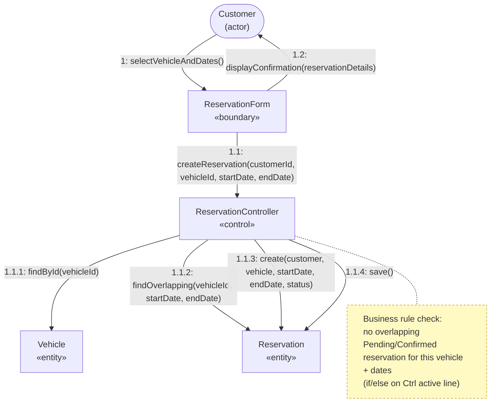
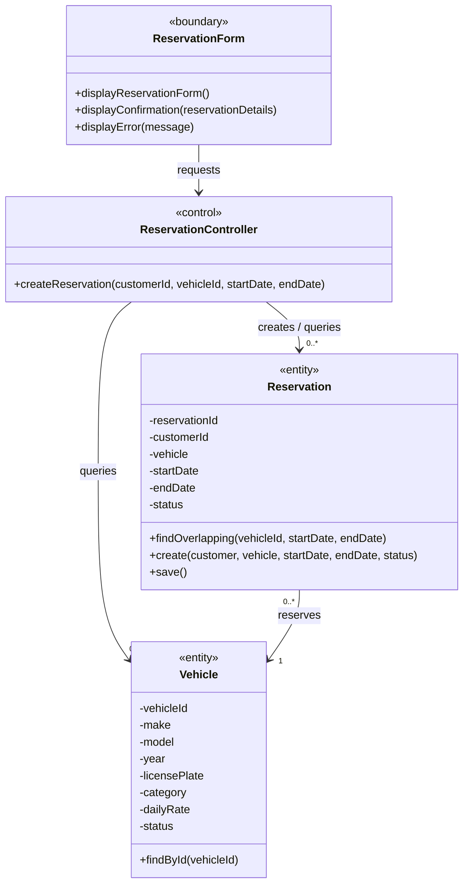
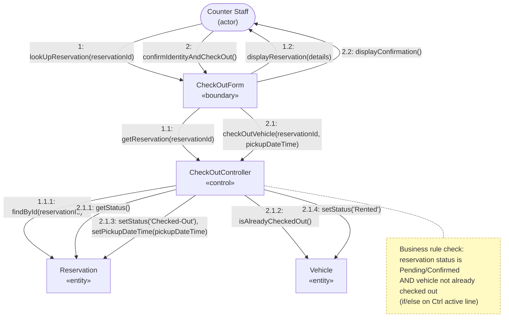
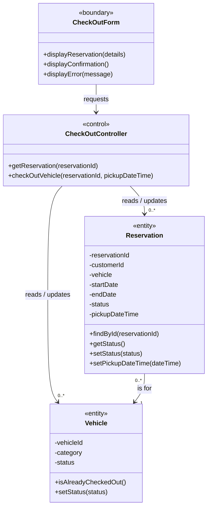
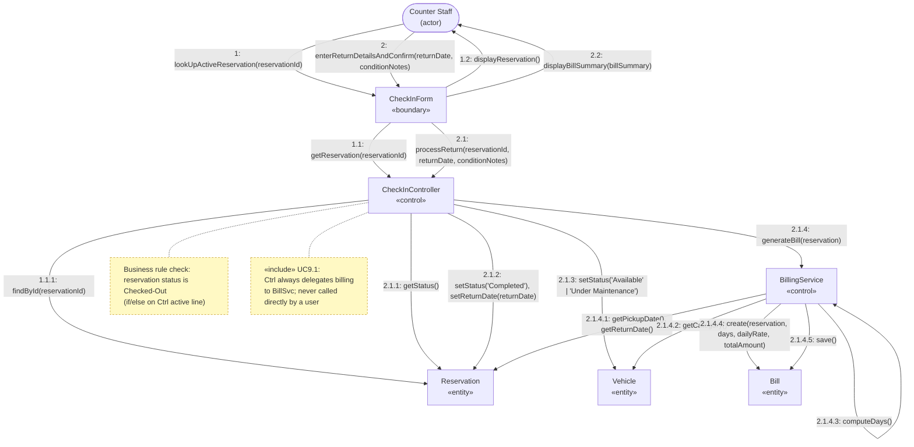
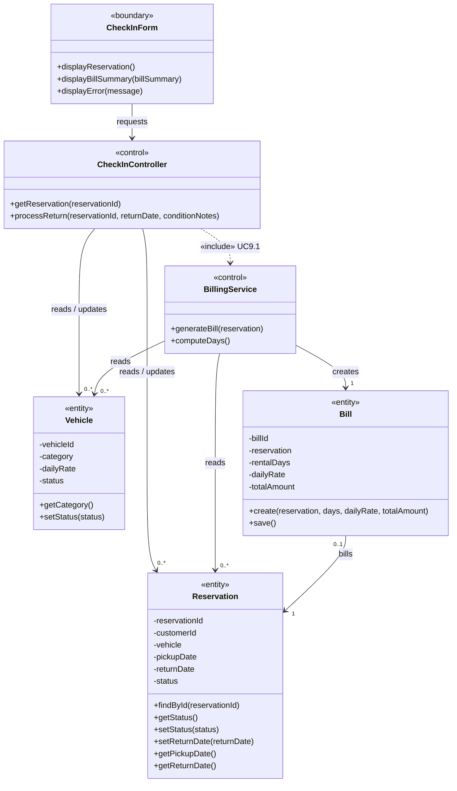

Mariam Natukunda
618983

# Lab 5: Collaboration and VOPC Diagrams for RentaCar

**Project Repository (GitHub):** https://github.com/magicmarie/RentaCar

**Related Documents:** Vision_Document_RentaCar.md, UseCaseDescription_RentaCar.md,
SystemArchitecture_RentaCar.md, SequenceDiagrams_RentaCar.md

---

## 1. Introduction

This document continues the Use-Case Analysis started in Lab 4 (`SequenceDiagrams_RentaCar.md`)
by carrying the same three use-case realizations through the remaining Use-Case Analysis
steps shown on slides 41-57 of Lesson 7:

1. **Model object collaborations** — a Collaboration Diagram for each realization, derived
   directly from the corresponding Lab 4 sequence diagram (slides 36-38, "Relationships from
   Collaboration Diagram").
2. **Model structure in a VOPC diagram** — a View-Of-Participating-Classes diagram per
   realization that captures responsibilities as operations (slide 42), adds analysis-level
   attributes and associations with multiplicity (slides 45-49), and reviews whether
   generalization applies (slides 50-52).
3. **Verify business rules are covered** — for each realization, confirm every business rule
   from `UseCaseDescription_RentaCar.md` is reflected as either a simple if/else on a control
   class's active line, or (if it required multiple conditional checks) a separate alternative
   flow — per the Rule A/B guideline on slide 54.

The three realizations, unchanged from Lab 4, are:

| # | Use Case / Flow | Actor |
|---|---|---|
| 1 | UC6.2 Create Reservation | Customer |
| 2 | UC7.1 Process Check-Out | Counter Staff |
| 3 | UC8.1 Process Return (includes UC9.1 Calculate and Generate Bill) | Counter Staff |

Only the analysis classes participating in each specific realization are shown per VOPC
(slide 40) — this is not a full domain model, just the "slice" relevant to that use case.

---

## 2. Realization 1 — Create Reservation (UC6.2)

### 2.1 Collaboration Diagram

Message numbers follow the hierarchical call-nesting convention shown on slides 27-28 (only
forward/call messages — `->>` in the Lab 4 sequence diagram — are numbered; replies are
implicit). Business-rule checks are shown as a note, matching the note style on slide 29.

Steps 1.1.3/1.1.4 only fire on the "no overlap" branch of the alt block in the Lab 4 sequence
diagram; on the "already booked" branch, `Ctrl` instead sends `1.1.3': error(...)` back to `UI`.

### 2.2 VOPC Diagram

`Customer` is deliberately excluded as an entity class here (slide 16, "ignore actors") — it is
referenced only as `customerId`, since Customer Account Management is its own use case (UC5).

### 2.3 Business Rule Coverage

| Business Rule (from SRS UC6.2) | Rule Type (slide 54) | Where Modeled |
|---|---|---|
| A vehicle cannot have two confirmed/pending reservations with overlapping dates (no double-booking) | A — simple: single if/else | `ReservationController`'s active line, step 1.1.2 → 1.1.3, matching the `alt` block in Lab 4 SD1 |
| The end date must be after the start date | A — simple: single if/else | Validated by `ReservationController` before the availability check (precondition on `createReservation`) |

---

## 3. Realization 2 — Vehicle Check-Out (UC7.1)

### 3.1 Collaboration Diagram

Steps 2.1.3/2.1.4 only fire on the "valid state" branch; otherwise `Ctrl` sends
`2.1.3': error("check-out cannot proceed")` back to `UI`.

### 3.2 VOPC Diagram

### 3.3 Business Rule Coverage

| Business Rule (from SRS UC7.1) | Rule Type | Where Modeled |
|---|---|---|
| A vehicle can only be checked out against a reservation that is Pending or Confirmed, and not already checked out | A — simple: single if/else (two conditions ANDed, still one decision point) | `CheckOutController`'s active line, steps 2.1.1/2.1.2 → 2.1.3, matching the `alt` block in Lab 4 SD2 |

---

## 4. Realization 3 — Vehicle Check-In / Return, including Billing (UC8.1 → UC9.1)

This realization has two control classes: `CheckInController` (UC8.1) and `BillingService`
(UC9.1), connected by an `<<include>>` dependency — `BillingService.generateBill()` is only
ever invoked from `CheckInController.processReturn()`, never directly by a user, per the SRS
`<<include>>` relationship documented in `UseCaseDescription_RentaCar.md` §2.2.4.

### 4.1 Collaboration Diagram

Steps 2.1.2 through 2.2 only fire on the "status is Checked-Out" branch; otherwise `Ctrl` sends
`2.1.2': error("return cannot be processed")` back to `UI`. Step 2.1.3 itself has a nested
condition (`conditionNotes` flags an issue or not) — still a single decision on `Ctrl`'s active
line, so it stays Rule Type A rather than needing a separate diagram.

### 4.2 VOPC Diagram

### 4.3 Business Rule Coverage

| Business Rule (from SRS UC8.1 / UC9.1) | Rule Type | Where Modeled |
|---|---|---|
| Reservation must be in "Checked-Out" status to be returned | A — simple: single if/else | `CheckInController`'s active line, step 2.1.1 → 2.1.2, matching the `alt` block in Lab 4 SD3 |
| A bill can only be generated once, at the time of return, for a reservation that was checked out | A — simple, structural rather than conditional: enforced by only ever calling `BillingService.generateBill()` from inside `CheckInController.processReturn()`'s success branch, never exposing it to a user-invocable boundary | `«include»` dependency between `CheckInController` and `BillingService` in the VOPC (§4.2), matching the SRS `<<include>>` relationship |
| Number of rental days is computed as whole days; a partial day counts as a full day | A — simple: encapsulated in a single operation | `BillingService.computeDays()` self-call, step 2.1.4.3 |

---

## 5. Responsibility & Structure Review

Per slides 43 and 50-52, each VOPC was reviewed for the following:

**Orthogonal / redundant responsibilities (slide 43):** No orthogonal responsibilities were
found bundled into a single class — e.g. return-processing and bill-calculation are already
split across `CheckInController` and `BillingService` (established in Lab 4), rather than
merged into one control class, since they are two conceptually separate transactions
connected only by the `<<include>>` relationship. No redundant responsibilities were found
duplicated across classes (each boundary class's `display...()` operations are specific to
its own use case).

**Single-responsibility check (slide 43):** Every control and entity class above has at least
two compatible responsibilities (e.g., `Reservation` has `getStatus()`, `setStatus()`,
`findOverlapping()`, etc.), so none needed to be merged into a neighboring class for being
"too simple."

**Generalization (slides 50-52):** No generalization/specialization applies within these
three realizations — `Vehicle`, `Reservation`, and `Bill` are each used at a single level of
abstraction in all three VOPCs. A generalization such as a shared `UserAccount` superclass
for `Admin` / `Counter Staff` / `Customer` would be relevant to the **Authenticate User (UC1)**
realization, but that use case was not one of the three modeled in Lab 4/5.

---

## 6. References

- Vision Document: `Vision_Document_RentaCar.md`
- Use-Case Model / SRS: `UseCaseDescription_RentaCar.md`
- System Architecture: `SystemArchitecture_RentaCar.md`
- Sequence Diagrams (Lab 4): `SequenceDiagrams_RentaCar.md`
- Project Repository: https://github.com/magicmarie/RentaCar
