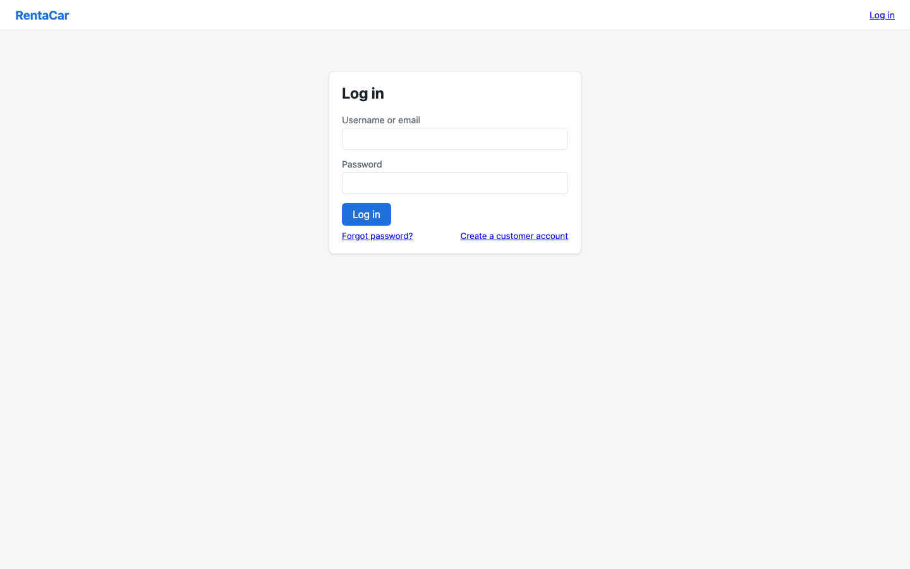
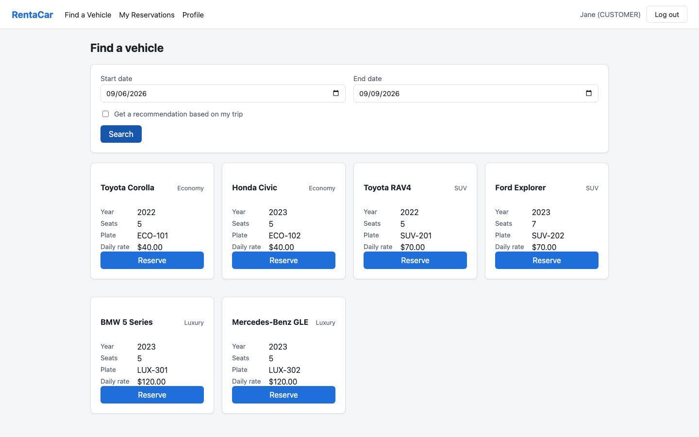
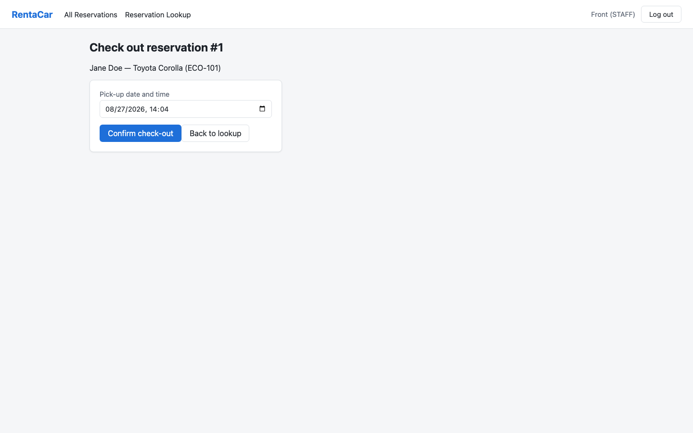
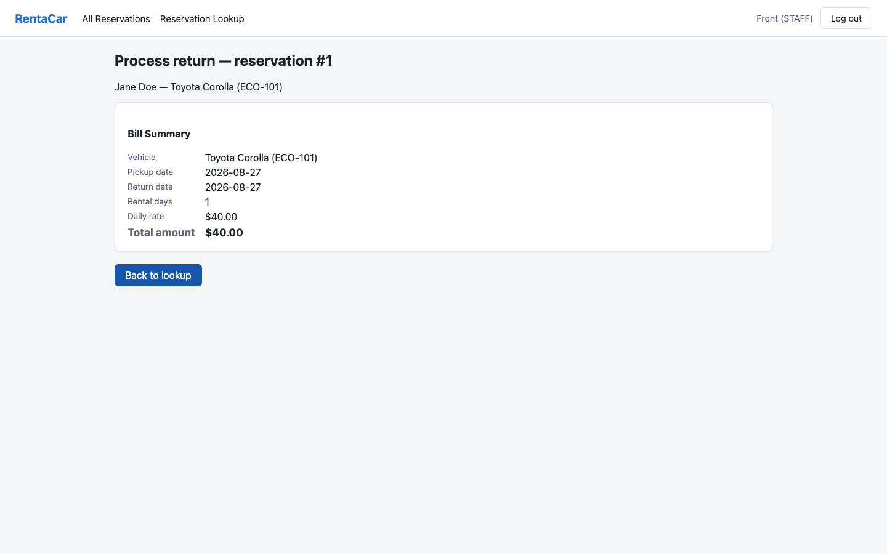
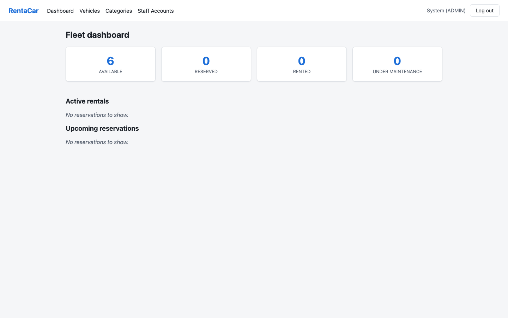

# AI Assisted RentaCar

A full-stack car rental management system that handles fleet inventory, customer
reservations, vehicle check-out/check-in, and automated billing — with a lightweight
AI-assisted recommendation to help customers pick a suitable vehicle. Built as a
Spring Boot REST API backed by a React + TypeScript single-page app, with role-based
access for **admins**, **staff**, and **customers**.

**Live demo:** [rentacar-frontend.onrender.com](https://rentacar-frontend.onrender.com)
(API: [rentacar-backend-a2et.onrender.com](https://rentacar-backend-a2et.onrender.com)) —
seeded accounts below. Both run on Render's free tier; the backend sleeps after
15 minutes idle, so the first request after a sleep takes ~1–2 minutes to wake up.
See [DEPLOYMENT.md](DEPLOYMENT.md) for how this is deployed and configured.

## Table of Contents

- [Overview](#overview)
- [Features](#features)
- [Roles & Permissions](#roles--permissions)
- [Tech Stack](#tech-stack)
- [Project Structure](#project-structure)
- [Getting Started](#getting-started)
  - [Prerequisites](#prerequisites)
  - [Running the Backend](#running-the-backend)
  - [Running the Frontend](#running-the-frontend)
  - [Default Seeded Accounts](#default-seeded-accounts)
- [Configuration](#configuration)
- [Database Setup](#database-setup)
- [API Endpoints](#api-endpoints)
- [Running Tests](#running-tests)
- [Screenshots](#screenshots)
- [Known Limitations & Future Improvements](#known-limitations--future-improvements)
- [Project Documentation](#project-documentation)
- [License](#license)

## Overview

Managing a car rental business with spreadsheets and paper forms is slow and
error-prone: double bookings, inaccurate availability, and inconsistent billing are
common as a fleet and customer base grow. RentaCar replaces that with a single
integrated platform that automates the full rental lifecycle — from searching
availability, to reserving a vehicle, to checking it out, to checking it back in and
generating a bill — while giving each type of user (admin, staff, customer) an
interface scoped to what they need.

## Features

**Customers**
- Register and log in (JWT-based auth), reset a forgotten password by email
- Search for available vehicles by date range and category
- Get a simple AI-assisted vehicle recommendation for a trip
- Make and cancel reservations, and view reservation history
- View and update their profile

**Staff**
- Look up reservations
- Check out a vehicle to a customer at pickup
- Process a vehicle return (check-in), which automatically generates the bill

**Admins**
- Manage the vehicle fleet (add, update, remove vehicles)
- Manage vehicle categories and daily rental rates
- Manage staff accounts (create, update, deactivate)
- View a dashboard summarizing fleet and rental activity

## Roles & Permissions

Admin and staff are deliberately kept separate — **admin manages the business,
staff runs the counter** — and the backend enforces this split (each protected
endpoint checks for a specific role, so an admin token can't call a staff-only
endpoint and vice versa):

| Capability                                       | Admin | Staff | Customer |
|---------------------------------------------------|:-----:|:-----:|:--------:|
| Register, log in, manage own profile               |       |       |    ✅    |
| Search available vehicles / get recommendation    |       |       |    ✅    |
| Make / cancel own reservations                    |       |       |    ✅    |
| **Check out** a vehicle to a customer              |   ❌  |  ✅   |          |
| **Check in** a return & generate the bill          |   ❌  |  ✅   |          |
| Look up / cancel **any** customer's reservation    |   ✅  |  ✅   | own only |
| See active rentals & upcoming reservations (overview) | ✅ |  ❌   |          |
| Add / edit / remove vehicles                       |   ✅  |  ❌   |          |
| Manage vehicle categories & daily rates            |   ✅  |  ❌   |          |
| Create / edit / deactivate staff accounts          |   ✅  |  ❌   |          |

The key thing to note: **admins can't check vehicles in or out**, and **staff can't
touch the fleet, rates, or staff accounts**. Admin is back-office management
(inventory, pricing, staffing); staff is front-desk operations (handing over keys and
processing returns). This mirrors a real rental counter, where the person managing
the business isn't necessarily the one standing at the counter, and keeps either role
from being able to both set up a booking scenario *and* be the one who hands
over/receives the vehicle for it.

Staff **do** see every customer's reservations — the ownership check that limits
`GET /reservations/{id}` and cancellation only applies to customers; staff and admin
tokens bypass it and can look up or cancel any reservation. Staff have two ways
to find one: [All Reservations](frontend/src/pages/staff/AllReservationsPage.tsx)
— filterable by status and searchable by customer name/email or license plate,
with check-out/check-in/cancel actions right in the list — and
[Reservation Lookup](frontend/src/pages/staff/ReservationLookupPage.tsx) for
jumping straight to one by ID. Admins instead get an aggregate view: the
dashboard (`GET /api/dashboard`) surfaces all active rentals and all upcoming
reservations across every customer, alongside fleet status counts — but, by
design, admins can't act on them (no checkout/check-in) or cancel them from
there.

## Tech Stack

**Backend**
- Java 21, Spring Boot 3.3.4 (Web, Data JPA, Security, Validation, Mail)
- JWT authentication ([jjwt](https://github.com/jwtk/jjwt))
- H2 (file-backed, dev) / MySQL (prod) via Spring Data JPA + Hibernate
- Lombok
- Maven

**Frontend**
- React 19 + TypeScript
- Vite 8
- React Router 7
- Axios
- Oxlint

## Project Structure

```
SWE/
├── backend/    Spring Boot REST API (Java 21, Maven)
└── frontend/   React + TypeScript SPA (Vite)
```

## Getting Started

### Prerequisites

- [Java 21](https://adoptium.net/) and Maven (or use the included `mvnw`, if present)
- [Node.js](https://nodejs.org/) 18+ and npm
- No database installation needed for local development — the backend runs on a
  file-backed H2 database by default

### Running the Backend

```bash
cd backend
mvn spring-boot:run
```

The API starts on **http://localhost:8080** using the `dev` Spring profile (file-backed
H2 database, auto-seeded with sample data — see below). An H2 web console is
available at `http://localhost:8080/h2-console` (JDBC URL: `jdbc:h2:file:./data/rentacar`,
user: `sa`, no password).

### Running the Frontend

In a separate terminal:

```bash
cd frontend
npm install
npm run dev
```

The app starts on **http://localhost:5173**. Vite proxies any `/api/*` request to the
backend at `http://localhost:8080`, so no extra CORS/API-URL configuration is needed
for local development.

### Default Seeded Accounts

On first run (when the database is empty), the backend seeds three accounts and a
handful of sample vehicles/categories so you can explore each role immediately:

| Role     | Email                  | Password      |
|----------|-------------------------|---------------|
| Admin    | `admin@rentacar.com`    | `admin123`    |
| Staff    | `staff@rentacar.com`    | `staff123`    |
| Customer | `customer@rentacar.com` | `customer123` |

## Configuration

The backend is configured via environment variables (see
[`backend/src/main/resources/application.properties`](backend/src/main/resources/application.properties)
and the `dev`/`prod` profile files for full defaults):

| Variable                      | Purpose                                         | Default (dev)                              |
|--------------------------------|--------------------------------------------------|---------------------------------------------|
| `SPRING_PROFILES_ACTIVE`      | Active profile (`dev` or `prod`)                | `dev`                                       |
| `JWT_SECRET`                  | Secret used to sign JWTs                        | dev-only placeholder — override in prod     |
| `JWT_EXPIRATION_MS`           | JWT expiration, in milliseconds                 | `86400000` (24h)                            |
| `CORS_ALLOWED_ORIGINS`        | Comma-separated allowed origins                 | `http://localhost:5173`                     |
| `MAIL_FROM`                   | "From" address for outgoing email               | `no-reply@rentacar.com`                     |
| `FRONTEND_RESET_PASSWORD_URL` | Link embedded in password-reset emails          | `http://localhost:5173/reset-password`      |
| `MAILTRAP_HOST/PORT/USERNAME/PASSWORD` | Dev SMTP sandbox (get creds from [Mailtrap](https://mailtrap.io)) | Mailtrap sandbox |
| `DB_URL` / `DB_USERNAME` / `DB_PASSWORD` | MySQL connection (prod profile only) | `jdbc:mysql://localhost:3306/rentacar` |

The frontend reads `VITE_API_PROXY_TARGET` (optional) to point the dev proxy at a
non-default backend URL — see
[`frontend/vite.config.ts`](frontend/vite.config.ts).

## Database Setup

**Dev (default):** nothing to install. The `dev` profile uses a file-backed H2
database (`backend/data/rentacar.mv.db`, gitignored) that's created automatically on
first run and re-seeded by `DataSeeder` whenever it's empty.

**Prod (MySQL):**

1. Create a database and a user with privileges on it:
   ```sql
   CREATE DATABASE rentacar CHARACTER SET utf8mb4;
   CREATE USER 'rentacar'@'%' IDENTIFIED BY 'a-real-password';
   GRANT ALL PRIVILEGES ON rentacar.* TO 'rentacar'@'%';
   ```
2. Set `DB_URL`, `DB_USERNAME`, `DB_PASSWORD` (see [Configuration](#configuration))
   to point at it.
3. Start the app with `SPRING_PROFILES_ACTIVE=prod`. Hibernate creates/updates the
   schema on boot (`spring.jpa.hibernate.ddl-auto=update`); no separate migration
   step is required for this project's scope.
4. `rentacar.jwt.secret` has **no default** under the `prod` profile — the app
   fails fast on boot if `JWT_SECRET` isn't set, rather than silently signing
   tokens with the dev placeholder.

## API Endpoints

All endpoints are prefixed with `/api`. Endpoints marked 🔒 require a valid JWT
(sent as `Authorization: Bearer <token>`); the role column shows which role(s) are
authorized where access is further restricted.

| Method | Endpoint                              | Role     | Description                              |
|--------|-----------------------------------------|----------|-------------------------------------------|
| POST   | `/auth/login`                           | Public   | Log in, returns a JWT                     |
| POST   | `/auth/register`                        | Public   | Register a new customer account           |
| POST   | `/auth/forgot-password`                 | Public   | Request a password-reset email            |
| POST   | `/auth/reset-password`                  | Public   | Reset password using a reset token        |
| GET    | `/categories`                           | 🔒       | List vehicle categories                   |
| GET    | `/categories/{id}`                      | 🔒       | Get a category                            |
| POST   | `/categories`                           | 🔒 Admin | Create a category                         |
| PUT    | `/categories/{id}/rate`                 | 🔒 Admin | Update a category's daily rate            |
| DELETE | `/categories/{id}`                      | 🔒 Admin | Delete a category                         |
| GET    | `/vehicles`                             | 🔒 Admin | List vehicles (optionally by category)    |
| GET    | `/vehicles/{id}`                        | 🔒 Admin | Get a vehicle                             |
| POST   | `/vehicles`                             | 🔒 Admin | Add a vehicle                             |
| PUT    | `/vehicles/{id}`                        | 🔒 Admin | Update a vehicle                          |
| DELETE | `/vehicles/{id}`                        | 🔒 Admin | Remove a vehicle                          |
| GET    | `/reservations`                         | 🔒 Staff/Admin | Search/list reservations (by status and/or customer/plate) |
| GET    | `/reservations/available`               | 🔒       | Search vehicles available for a date range |
| GET    | `/reservations/recommend`               | 🔒 Customer | Get an AI-assisted vehicle recommendation |
| POST   | `/reservations`                         | 🔒 Customer | Create a reservation                      |
| GET    | `/reservations/me`                      | 🔒 Customer | View own reservation history               |
| GET    | `/reservations/{id}`                    | 🔒       | Get a reservation                          |
| POST   | `/reservations/{id}/cancel`             | 🔒       | Cancel a reservation                       |
| POST   | `/checkout/{reservationId}`             | 🔒 Staff | Check out a vehicle for a reservation      |
| POST   | `/checkin/{reservationId}`              | 🔒 Staff | Process a return and generate the bill     |
| GET    | `/bills/reservation/{reservationId}`    | 🔒       | Get the bill for a reservation             |
| GET    | `/customers/me`                         | 🔒 Customer | View own profile                          |
| PUT    | `/customers/me`                         | 🔒 Customer | Update own profile                        |
| GET    | `/staff-accounts`                       | 🔒 Admin | List staff accounts                       |
| GET    | `/staff-accounts/{id}`                  | 🔒 Admin | Get a staff account                       |
| POST   | `/staff-accounts`                       | 🔒 Admin | Create a staff account                    |
| PUT    | `/staff-accounts/{id}`                  | 🔒 Admin | Update a staff account                    |
| POST   | `/staff-accounts/{id}/deactivate`       | 🔒 Admin | Deactivate a staff account                |
| GET    | `/dashboard`                            | 🔒 Admin | Get fleet/rental summary stats            |

## Running Tests

**Backend** (JUnit, unit + integration tests):

```bash
cd backend
mvn test
```

**Frontend** (lint):

```bash
cd frontend
npm run lint
```

**Evidence** — last local run, 129 tests across 23 files (unit, controller/MockMvc,
and one full-stack integration test covering the reservation → check-out →
check-in → bill lifecycle):

```
[INFO] Tests run: 129, Failures: 0, Errors: 0, Skipped: 0
[INFO] BUILD SUCCESS
```

## Screenshots

|  |  |
|---|---|
| **Login** | **Customer — search & reserve** |
|  |  |
| **Staff — check-out** | **Staff — check-in, bill generated** |
|  |  |
| **Admin — fleet dashboard** | |
|  | |

## Known Limitations & Future Improvements

**Limitations**
- The double-booking check (search + create) isn't fully race-safe: two
  near-simultaneous bookings for the same vehicle/dates could both pass the
  overlap check before either is committed. There's no DB-level unique
  constraint or row lock backing it up yet.
- The "AI-assisted" recommendation ([`RecommendationService`](backend/src/main/java/com/rentacar/service/RecommendationService.java))
  is deliberately rule-based (filter by seats/budget, sort by price) — no
  external ML service, per the Vision Document's stated scope.
- No payment gateway integration — `Bill` records an amount owed, it doesn't
  process a card.
- No automated frontend test suite; the frontend relies on TypeScript's type
  checking and oxlint, backed by manual QA across all three roles.
- The staff "All Reservations" list has no pagination — fine at the current
  seed-data scale, would need it for a fleet with a real reservation volume.
- Double-booking prevention is planned-date-based, not real-time: a new
  reservation is checked against other reservations' *planned* start/end
  dates, not whether a vehicle is actually back yet. If a customer returns
  late, a reservation booked for right after can still be accepted — it'll
  correctly fail at check-out time (`checkOut()` refuses a `RENTED` vehicle,
  so two customers can never actually be handed the same car), but staff
  only find out that day, not in advance. This is a deliberate trade-off:
  the alternative (treating every checked-out vehicle as unavailable
  indefinitely, since its true return time is unknown) would block
  legitimate future bookings far more often than late returns actually
  happen — real rental counters accept and resolve this same risk rather
  than over-block their fleet.

**Future Improvements**
- Add a DB-level unique constraint (or optimistic locking) on overlapping
  reservations to close the race condition above.
- Frontend component/e2e tests (e.g. Vitest + Testing Library, or Playwright).
- Real payment processing on check-in.
- Refresh tokens, so a 24h JWT isn't the only session lifetime lever.
- Pagination on the All Reservations list.

## Project Documentation

This repository also includes the software engineering documents produced during the
design of the system:

- [Vision Document](Vision_Document_RentaCar.md)
- [Use Case Descriptions](UseCaseDescription_RentaCar.md)
- [System Architecture](SystemArchitecture_RentaCar.md)
- [Sequence Diagrams](SequenceDiagrams_RentaCar.md)
- [Collaboration/VOPC Diagrams](CollaborationVOPCDiagrams_RentaCar.md)

## License

This project was built for educational purposes as part of a Software Engineering
course.
