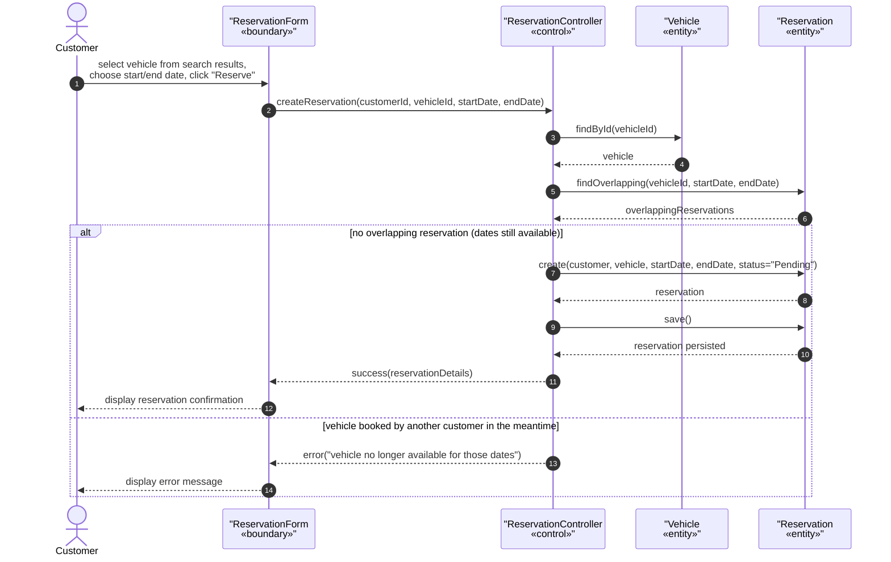
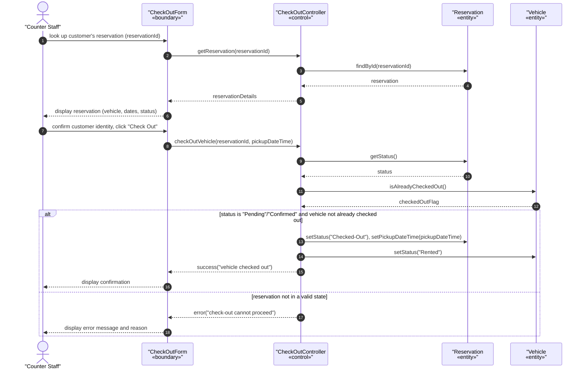
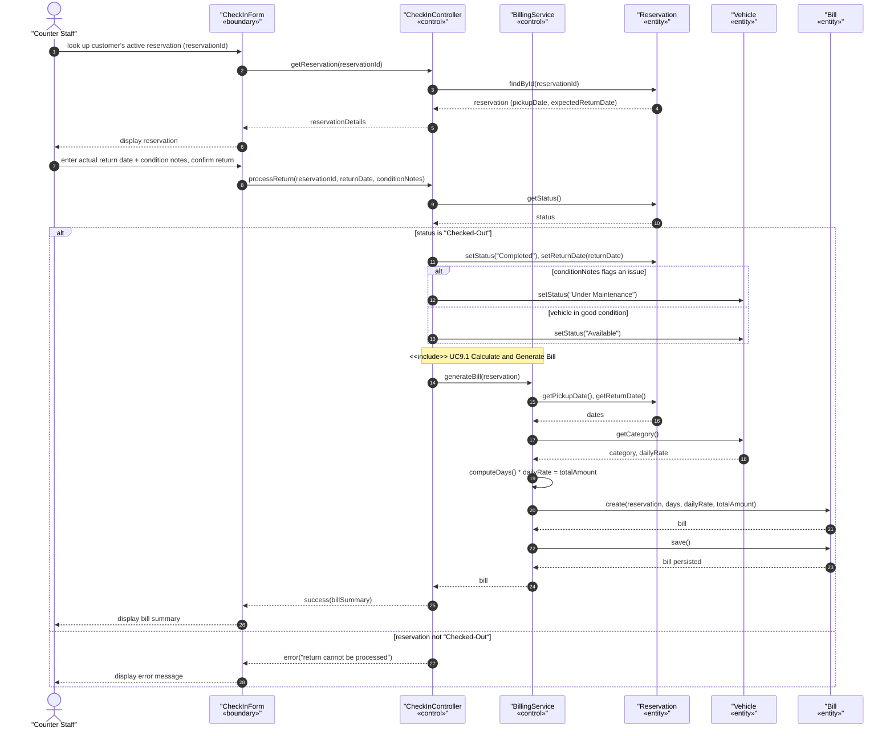

Mariam Natukunda
618983

# Lab 4: Use-Case Analysis and Sequence Diagrams for RentaCar

**Project Repository (GitHub):** https://github.com/magicmarie/RentaCar

**Related Documents:** Vision_Document_RentaCar.md, UseCaseDescription_RentaCar.md, SystemArchitecture_RentaCar.md

---

## 1. Introduction

This document performs further analysis on the RentaCar use-case model (see
`UseCaseDescription_RentaCar.md`) by producing sequence diagrams for three of the
system's major, significant use cases, following the style shown on slide 30 of the
Lesson 7 lecture. Together, these three use cases form the core rental transaction
lifecycle — a reservation is created, the vehicle is checked out, and the vehicle is
checked in/returned (which in turn includes Billing, per the `<<include>>` relationship
identified in the SRS use-case diagram for the Customer & Billing Subsystem).

For each use case, the analysis classes are identified using the standard three
stereotypes:

- **«boundary»** — the interface between the actor and the system (an SPA form/page).
- **«control»** — the coordinating object that carries out the use case's logic and
  enforces its business rules (a controller/service class).
- **«entity»** — a persistent domain object the control class reads or updates
  (Vehicle, Reservation, Bill).

These map onto the layered architecture in `SystemArchitecture_RentaCar.md`: boundary
classes correspond to React SPA components, control classes correspond to the Spring
MVC controllers/business services, and entity classes correspond to the JPA-persisted
domain model.

---

## 2. Sequence Diagram 1 — Create Reservation (UC6.2)

**Use case:** Reservation Management → 6.2 Create Reservation
**Actor:** Customer
**Preconditions:** Customer is authenticated and has already searched availability
(flow 6.1) and is selecting a vehicle from the results.
**Business rule realized:** A vehicle cannot have two overlapping Pending, Confirmed,
or Checked-Out reservations (no double-booking).

| Stereotype | Class | Role |
|---|---|---|
| «boundary» | ReservationForm | SPA screen where the customer picks a vehicle and dates and submits the booking |
| «control» | ReservationController | Coordinates the booking workflow; re-validates availability before committing |
| «entity» | Vehicle | The vehicle being reserved |
| «entity» | Reservation | The reservation record being created and persisted |

---

## 3. Sequence Diagram 2 — Vehicle Check-Out (UC7.1)

**Use case:** Vehicle Check-Out → 7.1 Process Check-Out
**Actor:** Counter Staff
**Preconditions:** Staff is authenticated; a Pending/Confirmed reservation exists.
**Business rule realized:** A vehicle can only be checked out against a reservation
that is Pending or Confirmed and not already checked out.

| Stereotype | Class | Role |
|---|---|---|
| «boundary» | CheckOutForm | SPA screen where staff looks up a reservation and confirms pick-up |
| «control» | CheckOutController | Validates reservation state and coordinates the check-out |
| «entity» | Reservation | The reservation being checked out |
| «entity» | Vehicle | The vehicle whose status changes to "Rented" |

---

## 4. Sequence Diagram 3 — Vehicle Check-In / Return, including Billing (UC8.1 → UC9.1)

**Use case:** Vehicle Check-In / Return → 8.1 Process Return, which includes
Billing → 9.1 Calculate and Generate Bill via `<<include>>`.
**Actor:** Counter Staff
**Preconditions:** Staff is authenticated; the reservation status is "Checked-Out".
**Business rule realized:** A bill is generated exactly once, automatically, at the
time of return — never invoked directly by a user.

| Stereotype | Class | Role |
|---|---|---|
| «boundary» | CheckInForm | SPA screen where staff records the return |
| «control» | CheckInController | Validates reservation state, updates vehicle/reservation, triggers billing |
| «control» | BillingService | Invoked via `<<include>>`; computes and persists the bill (UC9.1) |
| «entity» | Reservation | The reservation being completed |
| «entity» | Vehicle | The vehicle whose status changes to "Available"/"Under Maintenance" |
| «entity» | Bill | The bill record created for this rental |

---

## 5. References

- Vision Document: `Vision_Document_RentaCar.md`
- Use-Case Model / SRS: `UseCaseDescription_RentaCar.md`
- System Architecture: `SystemArchitecture_RentaCar.md`
- Project Repository: https://github.com/magicmarie/RentaCar
