Mariam Natukunda
618983

# High-Level System Architecture for RentaCar

**Project Repository (GitHub):** https://github.com/magicmarie/RentaCar

**Related Documents:** Vision_Document_RentaCar.md, UseCaseDescription_RentaCar.md

---

## 1. Introduction

### 1.1 Purpose

This document applies the architectural analysis techniques covered in Lesson 6 to the
RentaCar project. It selects and justifies a system architecture for AI Assisted
RentaCar, given the problem described in the Vision Document and the use-case model
described in the SRS, and presents an initial High-Level System Architecture diagram
covering both the physical deployment tiers and the logical layers within the
application.

### 1.2 Scope

This document covers the architecture of all three subsystems identified in the Vision
Document (Fleet Management, Reservation, Customer & Billing) and the shared
Authentication use case, as a single architectural solution. It does not cover
low-level class design, database schema, or API contract details — those belong to
later design iterations.

---

## 2. Architecturally Significant Requirements

The following requirements, drawn from the Vision Document's "Other Product
Requirements" (section 5) and "Assumptions and Dependencies" (section 4.2), most
strongly influence the architecture:

| Requirement | Source | Architectural Implication |
|---|---|---|
| Availability search must respond within 3s; reservation submission within 5s | Performance | Favor a stateless API layer with efficient, indexed queries and a thin network hop between layers, rather than chatty, deeply nested remote calls |
| Users authenticate; RBAC must separate Admin, Staff, and Customer functions | Security | Centralized authentication/authorization enforced at the API boundary, not duplicated per screen |
| Customer pages must work on desktop and mobile browsers; no dedicated mobile app | Usability | A single responsive client (SPA) rather than separate native/mobile codebases |
| No confirmed reservation may be lost due to a system error | Reliability | Transactional business/data layers backed by an ACID relational database |
| Single rental location for the initial release; Java/Spring MVC/JPA on Tomcat; MySQL | Constraints (platform, scale) | A single deployable backend and single database is sufficient — no need for distributed/microservice complexity at this stage |
| Vehicle recommendation uses simple rule-based filtering, not an external AI service | Constraints | The recommendation logic lives inside the Reservation subsystem's business layer, not as a separate integrated service |

---

## 3. Selected Architecture Pattern and Rationale

RentaCar will use a **client-server, layered (N-tier) architecture**: a JavaScript
Single-Page Application (SPA) client consuming a RESTful Spring MVC API backend, with
the backend internally organized into presentation (API), business logic, and data
access layers over a relational database.

**Rationale, weighed against alternatives:**

- **Monolithic server-rendered MVC (rejected):** simplest option, but couples view
  rendering to the server and makes it harder to deliver the same responsive
  experience across desktop and mobile browsers required by the Vision Document
  (section 3.2, 5-Usability) without duplicating templates.
- **Two-WAR split, UI app + Web Service app (rejected):** viable, and structurally
  close to the course's sample architecture, but it still server-renders HTML in the
  "UI" tier and adds a second Java deployable and application-server context for no
  functional gain over a single REST backend, given RentaCar has no legacy system or
  ESB to bridge between two Java tiers.
- **SPA + REST API (selected):** cleanly separates client concerns (routing,
  role-based views, responsiveness) from server concerns (business rules, data
  persistence), matches the "accessible from desktop, mobile, or tablet" requirement
  with one codebase, and keeps the backend a single, simple, stateless deployable
  consistent with the "single rental location" scale constraint.
- **Spring Boot with an embedded servlet container, instead of a WAR deployed to an
  external Tomcat (selected):** Spring Boot packages the app and an embedded Tomcat
  instance together into one executable JAR, so there is no separate application
  server to install/configure — `java -jar` starts the whole backend. This removes a
  deployment step without changing anything about the layered structure inside the
  application, and is the modern default for new Spring projects.

This is still a layered architecture internally — each tier is composed of well-defined
layers (presentation/API, business logic, data access) as covered in Lesson 6 — it is
the client tier's technology (SPA vs. server-rendered pages) that differs from the
course's sample diagram.

---

## 4. High-Level System Architecture Diagram

```mermaid
flowchart TB
    subgraph ClientTier["PHYSICAL: Client Tier — Browser (desktop, mobile, tablet)"]
        SPA["React SPA<br/>Role-based views: Admin / Staff / Customer<br/>Routing, state management, HTML/CSS/JS"]
    end

    subgraph MiddleTier["PHYSICAL: Middle Tier — Java Runtime (JVM)"]
        subgraph WAR["RentaCar REST API — Spring Boot executable JAR (embedded Tomcat)"]
            Security["Spring Security<br/>JWT authentication + role-based access control"]
            subgraph API["Presentation / API Layer — Spring MVC @RestController"]
                FleetCtrl["Fleet Controllers<br/>Vehicle, Category, Staff Account"]
                ResCtrl["Reservation Controllers<br/>Search, Book, Cancel, Check-Out, Check-In"]
                CustCtrl["Customer & Billing Controllers<br/>Account, Bill"]
            end
            subgraph Business["Business Logic Layer — POJO Services"]
                FleetSvc["FleetService, CategoryService,<br/>StaffAccountService"]
                ResSvc["ReservationService<br/>+ RecommendationService (rule-based filtering)"]
                BillSvc["CustomerService, BillingService"]
            end
            subgraph DataAccess["Data Access Layer"]
                Repos["Spring Data JPA Repositories (DAO)"]
                Hibernate["Hibernate ORM"]
            end
        end
    end

    subgraph DataTier["PHYSICAL: Data Tier"]
        DB[("MySQL Database<br/>Vehicles, Categories, Reservations,<br/>Bills, User Accounts")]
    end

    SPA -- "HTTPS GET<br/>static SPA bundle (one-time load)" --> SPA
    SPA -- "HTTPS REST requests/responses<br/>JSON + JWT bearer token" --> API
    Security -.enforces RBAC on.-> API
    FleetCtrl --> FleetSvc
    ResCtrl --> ResSvc
    CustCtrl --> BillSvc
    FleetSvc --> Repos
    ResSvc --> Repos
    BillSvc --> Repos
    Repos --> Hibernate
    Hibernate -- "SQL via JDBC" --> DB
```

**Reading the diagram:** the browser loads the SPA bundle once, then all further
interaction is stateless REST calls carrying a JWT issued at login. Spring Security
intercepts every API request to enforce that Customers cannot reach Admin/Staff
endpoints and Staff cannot reach Admin-configuration endpoints (Vision Document,
section 5-Security). Controllers delegate to services that encapsulate business rules
(e.g., double-booking prevention, bill calculation, rule-based recommendation);
services delegate to Spring Data JPA repositories, which Hibernate maps to the MySQL
schema.

---

## 5. Subsystem-to-Layer Mapping

| Vision Subsystem | Use Cases (SRS) | API Controllers | Business Services | Notes |
|---|---|---|---|---|
| Shared | UC1 Authenticate User | AuthController | AuthService | Issues/validates JWTs; used by all three actor roles |
| Fleet Management | UC2 Manage Fleet Vehicles, UC3 Manage Vehicle Categories, UC4 Manage Staff Accounts, UC10 Fleet Status Dashboard | VehicleController, CategoryController, StaffAccountController, DashboardController | FleetService, CategoryService, StaffAccountService | Admin-only, enforced via RBAC |
| Reservation | UC6 Reservation Management, UC7 Vehicle Check-Out, UC8 Vehicle Check-In/Return | ReservationController, CheckOutController, CheckInController | ReservationService, RecommendationService | RecommendationService applies rule-based filtering (passenger count, budget, category) per Vision section 4.2 |
| Customer & Billing | UC5 Customer Account Management, UC9 Billing | CustomerController, BillingController | CustomerService, BillingService | BillingService is invoked internally by CheckInController per the `<<include>>` relationship (UC8 includes UC9) — never called directly from the client |

---

## 6. Technology Stack

| Layer | Technology | Rationale |
|---|---|---|
| Client | React SPA (JavaScript/TypeScript, HTML, CSS) | Single responsive codebase for desktop, mobile, and tablet; no dedicated mobile app required |
| API / Presentation | Spring MVC REST Controllers (`@RestController`), JSON | Consistent with the course's required Java/Spring MVC stack; stateless, framework-native REST support |
| Security | Spring Security + JWT | Stateless auth suited to a REST API; enforces role-based access control (Admin, Staff, Customer) at the API boundary |
| Business Logic | Plain Java service classes (POJOs) | Encapsulates business rules (no double-booking, billing calculation, recommendation filtering) independent of the web layer |
| Data Access | Spring Data JPA repositories | Reduces DAO boilerplate while satisfying the Vision Document's JPA requirement |
| ORM | Hibernate | Default JPA provider used with Spring Data JPA |
| Database | MySQL | Matches the Vision Document's relational database requirement |
| Deployment | Spring Boot with embedded Tomcat, packaged as an executable JAR | Matches the Vision Document's Spring Boot / embedded Tomcat requirement; no separate application server to install |

---

## 7. Key Architectural Decisions

- **Single deployable backend (one executable JAR):** the reservation, fleet, and
  billing subsystems all share one database and one rental location for this release,
  so splitting them into separate services would add operational complexity (service
  discovery, distributed transactions) without a corresponding benefit.
- **Stateless JWT authentication over server sessions:** because the client is a SPA
  making independent REST calls rather than requesting server-rendered pages, a
  stateless token avoids sticky-session/session-replication concerns entirely.
- **Business rules enforced server-side only:** rules such as "no overlapping
  reservations" and "bill generated only once, at return" (SRS, UC6/UC8) are enforced
  in the service layer, not the client, since the SPA cannot be trusted as the
  source of truth for these constraints.
- **Recommendation logic as an in-process service, not an external call:** per the
  Vision Document's assumption that recommendations use simple rule-based filtering,
  `RecommendationService` runs in the same JVM/transaction as the rest of the
  Reservation subsystem — there is no external AI/ML integration to design around.

---

## 8. Deployment View

For the initial release, all backend components are packaged into a single Spring
Boot executable JAR with an embedded Tomcat instance, run directly on a server with a
compatible Java runtime (`java -jar renta-car.jar`) — no separate application server
installation or WAR deployment step is required. It connects to a single MySQL
instance, which may run on the same host for development or a separate host in
production. The React SPA is built into static assets and can be served either from
the same embedded Tomcat instance (as static resources) or from any static file host
— the two are decoupled because all communication happens over the REST API, not
server-rendered pages.

---

## 9. References

- Vision Document: `Vision_Document_RentaCar.md`
- Use-Case Model / SRS: `UseCaseDescription_RentaCar.md`
- Project Repository: https://github.com/magicmarie/RentaCar
