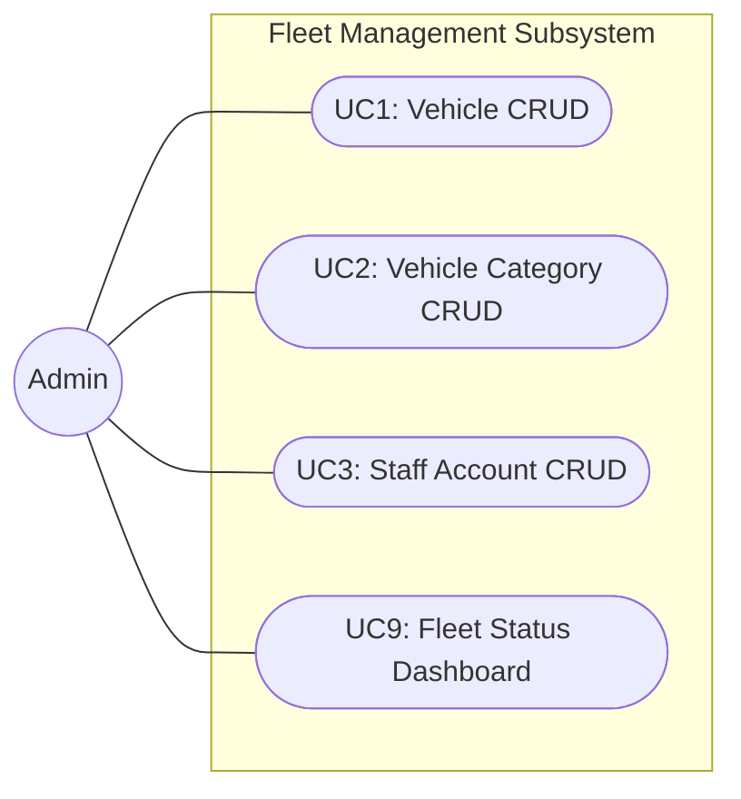
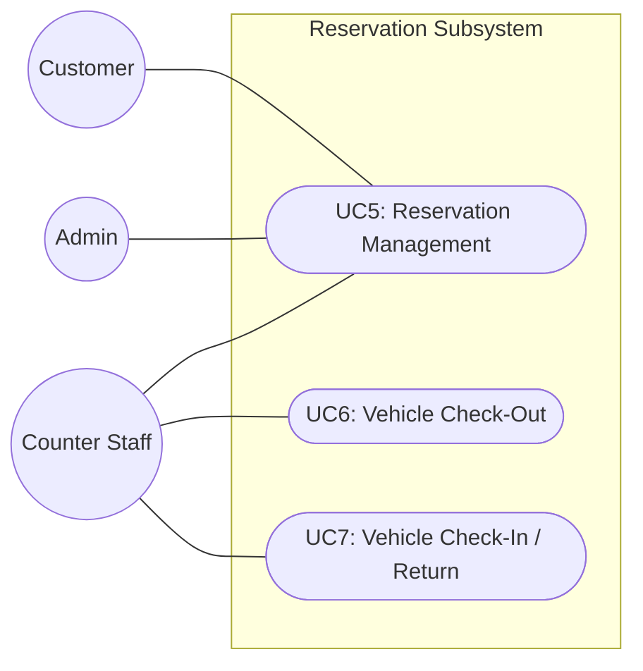
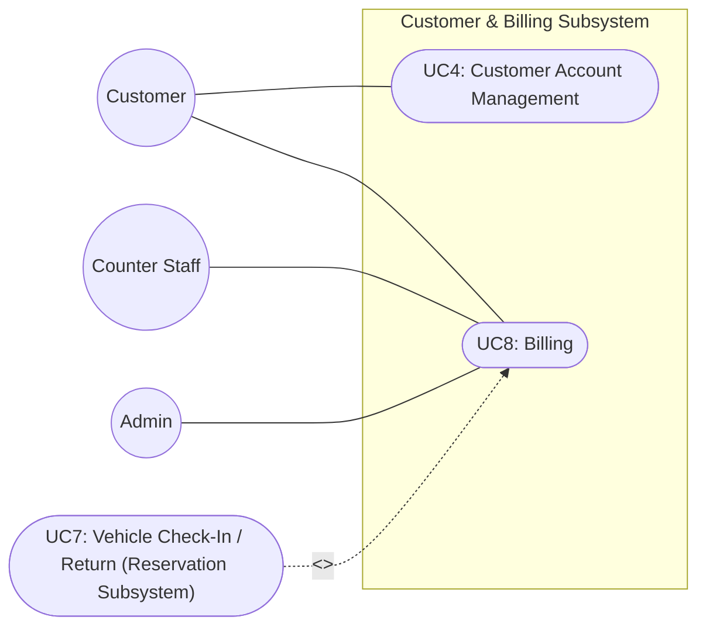

Mariam Natukunda
618983

# System Requirements Specification (SRS) for RentaCar

**Project Repository (GitHub):** https://github.com/magicmarie/RentaCar

**Related Document:** Vision_Document_RentaCar.md

---

## 1. Introduction

### 1.1 Purpose

This System Requirements Specification (SRS) applies the use-case-driven requirement
analysis techniques covered in Lessons 4 and 5 to the RentaCar project. It refines the
Problems, Needs, and Features documented in the Vision Document into a Use-Case Model —
consisting of use-case diagrams and detailed use-case descriptions — for the major use
cases of the system.

### 1.2 Scope

This document covers the use-case model for the three subsystems identified in the
Vision Document's Product Perspective (section 4.1): the Fleet Management Subsystem,
the Reservation Subsystem, and the Customer & Billing Subsystem.

---

## 2. Use-Case Model

### 2.1 Actors

An actor represents a role that interacts directly with the system. Of the stakeholders
listed in the Vision Document, Developers and Testers are project stakeholders but not
system actors, since they do not interact with the running system, and are therefore
excluded from the use-case model below.

| Actor | Description |
|---|---|
| Admin | Configures and manages the system: fleet inventory, vehicle categories, and staff accounts; views the fleet dashboard |
| Counter Staff | Processes vehicle check-outs and returns at the rental counter; may cancel a reservation on a customer's behalf |
| Customer | Registers and logs in, searches vehicle availability, creates and manages their own reservations, and views bills |

### 2.2 Use-Case Diagrams

#### 2.2.1 Fleet Management Subsystem

#### 2.2.2 Reservation Subsystem

#### 2.2.3 Customer & Billing Subsystem

The `<<include>>` relationship shows that Bill Generation (flow 8.1) is always triggered
as part of Process Return (flow 7.1) — it is never invoked directly by a user.

### 2.3 Use-Case Descriptions

The subsections below provide the detailed use-case descriptions for each use case shown
in the diagrams above, following the flow-of-events format: Actors, Preconditions, Basic
Flows (Step / User Actions / System Actions), Postconditions, and Business Rules.

---

## Use Case Number: 1
**Name:** Vehicle CRUD

**Brief description:** This use case allows the admin to manage the vehicle fleet inventory.

**Actors:** Admin

**Preconditions:** The admin must be logged in to the system.

### Flows of Events

#### 1.1 Create Vehicle

| Step | User Actions | System Actions |
|---|---|---|
| 1 | The admin calls the create vehicle command | The system displays the vehicle form with fields for make, model, year, license plate, and category. |
| 2 | The admin fills out the form and requests the system to save the details | The system verifies there is no other vehicle with the same license plate, saves the vehicle with status "Available", and returns a success message. It returns a fail message on exception, or a specific message when a duplicate license plate exists. |

**Postconditions:** The vehicle is persisted in the system with status "Available".

**Business Rules:** No two vehicles can share the same license plate. A vehicle must be assigned to exactly one existing category.

#### 1.2 Read/View Vehicle

| Step | User Actions | System Actions |
|---|---|---|
| 1 | The admin requests a list of vehicles, optionally filtered by category or status | The system returns a list of matching vehicles. |
| 2 | The admin selects a vehicle from the list | The system returns the vehicle object as a string with make, model, year, license plate, category, and current status. |

#### 1.3 Update Vehicle

| Step | User Actions | System Actions |
|---|---|---|
| 1 | The admin requests a list of vehicles | The system returns a list of all vehicles. |
| 2 | The admin selects the vehicle they want to update | The system displays an editable form pre-populated with the vehicle's details. |
| 3 | The admin changes the fields they want to update and requests the system to save the new details | The system updates the vehicle record and returns a success message, or a fail message on exception. |

**Postconditions:** The vehicle details will be updated.

**Business Rule:** The license plate field should be unwritable.

#### 1.4 Delete Vehicle

| Step | User Actions | System Actions |
|---|---|---|
| 1 | The admin requests a list of vehicles | The system returns a list of all vehicles. |
| 2 | The admin selects to delete a vehicle from the list | The system displays a confirmation dialogue window. |
| 3 | The admin selects OK on the confirmation dialog window to confirm deleting the vehicle | The system confirms the vehicle has no active or upcoming reservations and deletes it, returning a success message. If the vehicle is linked to a reservation, the system returns a message indicating the vehicle cannot be deleted because it is associated with a reservation. |

**Postconditions:** The vehicle will be deleted.

**Business Rule:** A vehicle must not have any active, pending, or upcoming reservations to be deleted.

---

## Use Case Number: 2
**Name:** Vehicle Category CRUD

**Brief description:** This use case allows the admin to manage vehicle categories and their daily rental rates.

**Actors:** Admin

**Preconditions:** The admin must be logged in to the system.

### Flows of Events

#### 2.1 Create Category

| Step | User Actions | System Actions |
|---|---|---|
| 1 | The admin calls the create category command | The system displays the category form with fields for name and daily rate. |
| 2 | The admin fills out the form and requests the system to save the details | The system verifies there is no other category with the same name, saves the category, and returns a success message. It returns a fail message on exception, or a specific message when a duplicate category name exists. |

**Postconditions:** The category is persisted in the system.

**Business Rule:** No two categories can have the same name.

#### 2.2 Read/View Category

| Step | User Actions | System Actions |
|---|---|---|
| 1 | The admin requests a list of categories | The system returns a list of all categories. |
| 2 | The admin selects a category from the list | The system returns the category object as a string with name and daily rate. |

#### 2.3 Update Category

| Step | User Actions | System Actions |
|---|---|---|
| 1 | The admin requests a list of categories | The system returns a list of all categories. |
| 2 | The admin selects the category they want to update | The system displays an editable form pre-populated with the category's name and daily rate. |
| 3 | The admin updates the daily rate and requests the system to save the new details | The system updates the category record and returns a success message, or a fail message on exception. |

**Postconditions:** The category's daily rate will be updated.

**Business Rule:** The category name should be unwritable once created.

#### 2.4 Delete Category

| Step | User Actions | System Actions |
|---|---|---|
| 1 | The admin requests a list of categories | The system returns a list of all categories. |
| 2 | The admin selects to delete a category from the list | The system displays a confirmation dialogue window. |
| 3 | The admin selects OK on the confirmation dialog window to confirm deleting the category | The system confirms no vehicle is assigned to the category and deletes it, returning a success message. Otherwise, it returns a message indicating the category is still assigned to some vehicles. |

**Postconditions:** The category will be deleted.

**Business Rule:** A category must not have any vehicles assigned to it before it can be deleted.

---

## Use Case Number: 3
**Name:** Staff Account CRUD

**Brief description:** This use case allows the admin to manage counter staff user accounts.

**Actors:** Admin

**Preconditions:** The admin must be logged in to the system.

### Flows of Events

#### 3.1 Create Staff Account

| Step | User Actions | System Actions |
|---|---|---|
| 1 | The admin calls the create staff account command | The system displays the staff account form with fields for firstname, lastname, email, and initial password. |
| 2 | The admin fills out the form and requests the system to save the details | The system verifies there is no other account with the same email address, saves the staff account as active, and returns a success message. It returns a fail message on exception, or a message indicating a duplicate entry when the email already exists. |

**Postconditions:** The staff account is persisted in the system and can log in.

**Business Rule:** No duplicate staff accounts. A unique account is identified by email address.

#### 3.2 Read/View Staff Account

| Step | User Actions | System Actions |
|---|---|---|
| 1 | The admin requests a list of staff accounts | The system returns a list of all staff accounts. |
| 2 | The admin selects an account from the list | The system returns the account as a string with firstname, lastname, email, and active/deactivated status. |

#### 3.3 Update Staff Account

| Step | User Actions | System Actions |
|---|---|---|
| 1 | The admin requests a list of staff accounts | The system returns a list of all staff accounts. |
| 2 | The admin selects the account they want to update | The system displays an editable form pre-populated with the staff account's details. |
| 3 | The admin updates the fields they want to update and requests the system to save the new details | The system updates the record and returns a success message, or a fail message on exception. |

**Postconditions:** The staff account will be updated.

**Business Rule:** The email field should be unwritable.

#### 3.4 Deactivate Staff Account

| Step | User Actions | System Actions |
|---|---|---|
| 1 | The admin requests a list of staff accounts | The system returns a list of all staff accounts. |
| 2 | The admin selects to deactivate a staff account from the list | The system displays a confirmation dialogue window. |
| 3 | The admin selects OK on the confirmation dialog window to confirm deactivation | The system marks the account as deactivated so it can no longer log in, and returns a success message. |

**Postconditions:** The staff account will be deactivated and will no longer be able to authenticate.

**Business Rule:** Staff accounts are deactivated rather than deleted, to preserve the audit trail of past check-outs and returns they processed.

---

## Use Case Number: 4
**Name:** Customer Account Management

**Brief description:** This use case allows a customer to register, log in, and view or update their own profile.

**Actors:** Customer

**Preconditions:** None for registration and login. The customer must be logged in to view or update their profile.

### Flows of Events

#### 4.1 Register Customer Account

| Step | User Actions | System Actions |
|---|---|---|
| 1 | The customer calls the registration command | The system displays the registration form with fields for firstname, lastname, email, driver's license number, username, and password. |
| 2 | The customer fills out the form and submits it | The system verifies no other customer has the same email, driver's license number, or username, saves the account, and returns a success message. It returns a fail message on exception, or a message indicating a duplicate entry in case of a duplicate. |

**Postconditions:** The customer account is persisted in the system.

**Business Rule:** No duplicate customer accounts. A unique account is identified by email, driver's license number, and username.

#### 4.2 Login

| Step | User Actions | System Actions |
|---|---|---|
| 1 | The customer enters their username and password and submits the login form | The system verifies the credentials against the stored account. On success, it grants a session with customer privileges. On failure, it returns a message indicating invalid credentials. |

**Business Rule:** A customer cannot access admin or staff functions with their session.

#### 4.3 View/Update Customer Profile

| Step | User Actions | System Actions |
|---|---|---|
| 1 | The customer selects to view their profile | The system returns the customer's profile with firstname, lastname, email, and driver's license number. |
| 2 | The customer selects to edit the profile and updates the fields they want to change | The system updates the record and returns a success message, or a fail message on exception. |

**Postconditions:** The customer's profile will be updated.

**Business Rule:** The email and driver's license number fields should be unwritable.

---

## Use Case Number: 5
**Name:** Reservation Management

**Brief description:** This use case allows a customer to search for available vehicles, create a reservation, cancel a reservation, and view their reservation history. It also allows staff and admins to cancel a reservation on a customer's behalf.

**Actors:** Customer, Counter Staff, Admin

**Preconditions:** The customer must be logged in to create, cancel, or view their own reservations.

### Flows of Events

#### 5.1 Search Vehicle Availability

| Step | User Actions | System Actions |
|---|---|---|
| 1 | The customer selects a start date, end date, and optionally a vehicle category | The system checks which vehicles in the fleet have no overlapping confirmed reservation for the given date range and are not "Under Maintenance", and returns the list of available vehicles with their category and daily rate. |

**Business Rule:** Only vehicles with status "Available" and no overlapping reservation for the requested date range are returned.

#### 5.2 Create Reservation

| Step | User Actions | System Actions |
|---|---|---|
| 1 | The customer selects an available vehicle from the search results and requests to reserve it for the chosen date range | The system re-validates that the vehicle has no overlapping confirmed reservation for the requested dates. |
| 2 | The system confirms availability | The system creates the reservation with status "Pending", associates it with the customer and vehicle, and returns a success message with the reservation details. If the vehicle was booked by another customer in the meantime, the system returns a message indicating the vehicle is no longer available for those dates. |

**Postconditions:** The reservation is persisted with status "Pending".

**Business Rule:** A vehicle cannot have two confirmed or pending reservations with overlapping date ranges (no double-booking). The end date must be after the start date.

#### 5.3 Cancel Reservation

| Step | User Actions | System Actions |
|---|---|---|
| 1 | The customer (or staff/admin on the customer's behalf) selects a pending or confirmed reservation to cancel | The system displays a confirmation dialogue window. |
| 2 | The user selects OK to confirm the cancellation | The system verifies the vehicle has not already been checked out for that reservation, sets the reservation status to "Cancelled", and returns a success message. If the vehicle has already been checked out, the system returns a message indicating the reservation cannot be cancelled. |

**Postconditions:** The reservation status will be set to "Cancelled" and the vehicle becomes available again for those dates.

**Business Rule:** A reservation can only be cancelled before the vehicle has been checked out.

#### 5.4 View Reservation History

| Step | User Actions | System Actions |
|---|---|---|
| 1 | The customer selects to view their reservations | The system returns a list of all the customer's reservations, both active and past, with vehicle, dates, and status. |
| 2 | The customer selects a specific reservation | The system returns the reservation details as a string, including vehicle, category, dates, status, and (if completed) the associated bill summary. |

---

## Use Case Number: 6
**Name:** Vehicle Check-Out

**Brief description:** This use case allows counter staff to process the pick-up of a reserved vehicle by a customer.

**Actors:** Counter Staff

**Preconditions:** The staff member must be logged in. A confirmed or pending reservation for the customer must exist.

### Flows of Events

#### 6.1 Process Check-Out

| Step | User Actions | System Actions |
|---|---|---|
| 1 | The staff member looks up the customer's reservation | The system returns the reservation details, including vehicle, dates, and status. |
| 2 | The staff member confirms the customer's identity and requests to check out the vehicle | The system verifies the reservation status is "Pending" or "Confirmed" and that the vehicle is not already checked out. |
| 3 | The system confirms the checks pass | The system records the actual pick-up date and time, sets the reservation status to "Checked-Out", sets the vehicle status to "Rented", and returns a success message. If the reservation is not in a valid state, the system returns a message explaining why the check-out cannot proceed. |

**Postconditions:** The reservation status is "Checked-Out" and the vehicle status is "Rented".

**Business Rule:** A vehicle can only be checked out against a reservation that is Pending or Confirmed and not already checked out.

---

## Use Case Number: 7
**Name:** Vehicle Check-In / Return

**Brief description:** This use case allows counter staff to record the return of a rented vehicle. It includes Billing (Use Case 8) to generate the customer's bill.

**Actors:** Counter Staff

**Preconditions:** The staff member must be logged in. The reservation must have status "Checked-Out".

### Flows of Events

#### 7.1 Process Return

| Step | User Actions | System Actions |
|---|---|---|
| 1 | The staff member looks up the customer's active (checked-out) reservation | The system returns the reservation details, including vehicle, pick-up date, and expected return date. |
| 2 | The staff member enters the actual return date and any notes on vehicle condition, and confirms the return | The system verifies the reservation is in "Checked-Out" status. |
| 3 | The system confirms the check passes | The system sets the reservation status to "Completed", sets the vehicle status to "Available" (or "Under Maintenance" if the staff member flags a condition issue), then includes Use Case 8 (Billing, flow 8.1) to calculate the total rental cost and generate the bill, and returns a success message with the bill summary. |

**Postconditions:** The reservation status is "Completed", the vehicle status is updated, and a bill is generated and persisted.

**Business Rule:** A bill can only be generated once, at the time of return, for a reservation that was checked out.

---

## Use Case Number: 8
**Name:** Billing

**Brief description:** This use case covers the automatic calculation of rental cost (included by Use Case 7) and the ability for customers and staff to view a generated bill.

**Actors:** Customer, Counter Staff, Admin

**Preconditions:** A reservation must have been completed (vehicle returned) for a bill to exist.

### Flows of Events

#### 8.1 Calculate and Generate Bill

This flow is triggered via an `<<include>>` relationship from 7.1 Process Return (Use Case 7) and is not invoked directly by a user.

| Step | System Actions |
|---|---|
| 1 | The system computes the number of rental days from the actual pick-up and return dates. |
| 2 | The system multiplies the number of rental days by the vehicle category's daily rate to compute the total amount due. |
| 3 | The system persists a bill record containing vehicle details, rental dates, number of days, daily rate, and total amount due, linked to the reservation. |

**Business Rule:** The number of rental days is computed as whole days between pick-up and return; a partial day counts as a full day.

#### 8.2 View Bill

| Step | User Actions | System Actions |
|---|---|---|
| 1 | The customer or staff member selects a completed reservation | The system returns the associated bill as a string, showing vehicle details, rental dates, number of days, daily rate, and total amount due. |

**Business Rule:** A customer may only view bills linked to their own reservations. Staff and admins may view bills for any reservation.

---

## Use Case Number: 9
**Name:** Fleet Status Dashboard

**Brief description:** This use case provides the admin with a summary view of fleet status and business activity.

**Actors:** Admin

**Preconditions:** The admin must be logged in to the system.

### Flows of Events

#### 9.1 View Dashboard

| Step | User Actions | System Actions |
|---|---|---|
| 1 | The admin navigates to the dashboard | The system returns a summary showing the count of vehicles by status (Available, Reserved, Rented, Under Maintenance), the list of currently active rentals, and the list of upcoming reservations. |

**Business Rule:** Vehicle status shown on the dashboard must always reflect the latest state recorded by Reservation Management (Use Case 5) and Vehicle Check-Out/Check-In (Use Cases 6-7).

---

## 3. References

- Vision Document: `Vision_Document_RentaCar.md`
- Project Repository: https://github.com/magicmarie/RentaCar
